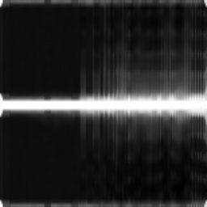

# mmWave_ML_Interview

## Question (a)
This question makes me think of **cocktail party problem**, however, the difference is also large. Looking at the signatures, it could be seen clearly that they are all spectrograms that are delivered by computing the STFT of a signal. An intuitive thought is to first extract some kind of prior-knowledge feature related to this specific circumstances and then use it together with K-means to perform clustering. However, the prior-knowledge is unknown, and hence dimension reduction should be performed without prior-knowledge. PCA and 2DPCA seems like an easy and straight forward method, their results are as below:

PCA for feature extraction + Silhouette Score for clustering:


2DPCA for feature extraction + Silhouette Score for clustering:


However, PCA's effectiveness of directly performing it on the values of a spectrogram is doubted. Since I am currently working with VAE, I started looking around with prior work, and indeed found one [Unsupervised Doppler Radar Based Activity Recognition for e-Healthcare](https://ieeexplore.ieee.org/document/9406586) which they first transformed the spectrograms into figures, and then trained a VAE on the figures. I did the same, and the results are as below:

VAE for feature extraction + Silhouette Score for clustering:

In that specific paper, they also claimed that using VAE would yield a much higher accuracy, hence my answer to the first question is 4, which the details of each sample as below.

For the specific implementation and the chain of thought, please refer to files:
```001_explore_doppler_signature.ipynb```, ```002_simple_method_explore.ipynb```, ```003_cvae_config_design.ipynb```, ```004_cvae_train.ipynb``` and ```005_cvae_inference.ipynb```.

## Question (b)
This question is tricky, since wihtout prior knowledge, it would be difficult to extract the features that matters. However, following the implementation of the previous question, I combined the clustering results and **LIME** (Local Interpretable Model-Agnostic Explanations) to identify the most representative attribute of each cluster. The results are as below, one example is shown for each cluster, please refer to the log of ```006_identify_representive_attribute.ipynb``` for more details.

Activity (cluster) 0:


Activity (cluster) 1:


Activity (cluster) 2:


Activity (cluster) 3:


## Question (c)
It has been found that the micro doppler signatures are extracted using method mentioned in paper **SPARCS: A Sparse Recovery Approach for Integrated Communication and Human Sensing in mmWave Systems**. However, due to the lack of prior knowledge and limited time, I did not implement the method. I simply performed STFT on the CIR signals to get the spectrograms, and then normalized and aggregated along the following steps:

1. Applied Short-Time Fourier Transform (STFT) with a Hanning window on each CIR signal
2. Performed FFT shift to center the frequency components
3. Converted the magnitude spectrum to dB scale
4. Applied 2D median filtering with a 5x5 kernel for noise reduction
5. Normalized the spectrograms along the frequency axis
6. Aggregated the normalized spectrograms across all antenna elements to obtain the final micro-Doppler signature

One version of the data is saved as .npy file under dir "data/b_sig" and the other version is transformed into figures and saved under the dir "data/b_sig_fig".

Some examples are shown below:





## Question (d)
### (i)

### (ii)

### (iii)