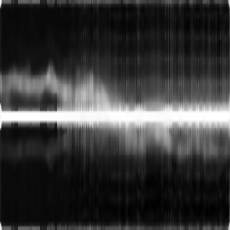

# mmWave_ML_Interview

## Question (a): Activity Clustering
The problem resembles the **cocktail party problem**, though with significant differences. The input data consists of spectrograms generated through STFT (Short-Time Fourier Transform). Three different approaches were explored for clustering:

1. **PCA-based Clustering:**
   - Applied PCA for feature extraction
   - Used Silhouette Score for optimal cluster determination
   

2. **2DPCA-based Clustering:**
   - Implemented 2DPCA for feature extraction
   - Used Silhouette Score for clustering evaluation
   

3. **VAE-based Clustering:**
   - Inspired by [Unsupervised Doppler Radar Based Activity Recognition for e-Healthcare](https://ieeexplore.ieee.org/document/9406586)
   - Converted spectrograms to images
   - Trained a VAE for feature extraction
   

**Result:** As research shows that the VAE-based clustering outperforms the other two methods, the VAE-based clustering result is chosen as the final answer, which is four clusters.

Implementation details can be found in:
- `001_explore_doppler_signature.ipynb`
- `002_simple_method_explore.ipynb`
- `003_cvae_config_design.ipynb`
- `004_cvae_train.ipynb`
- `005_cvae_inference.ipynb`

## Question (b): Feature Interpretation
To interpret the clustering results, I combined the VAE clusters with **LIME** (Local Interpretable Model-Agnostic Explanations) to identify distinctive features for each cluster:

| Cluster | Representative Example |
|---------|----------------------|
| Activity 0 |  |
| Activity 1 |  |
| Activity 2 |  |
| Activity 3 |  |

Detailed analysis available in `006_identify_representive_attribute.ipynb`.

## Question (c): Micro-Doppler Signature Extraction
While the original signatures were extracted using the **SPARCS** method, I implemented a simplified approach:

1. STFT application with Hanning window
2. FFT shift for frequency centering
3. dB scale conversion
4. 2D median filtering (5x5 kernel)
5. Frequency-axis normalization
6. Aggregation

Example signatures:

Implementation in `007_process_mat_files.ipynb` and `008_generate_signatures.ipynb`.

## Question (d): Advanced Analysis
### (i) Activity Recognition
The VAE model was retrained on the extracted micro-Doppler signatures:

Initial results suggest 10 distinct activities, though visual inspection indicates 4-5 might be more accurate. Further analysis would be beneficial.

### (ii) Identity Classification
Implemented a CNN-based classification model. Due to time constraints and limited data:
- No test set was separated
- Model hyperparameters require further tuning

Implementation in `012_identity_supervised.ipynb`.

### (iii) Complete Pipeline
A unified pipeline for activity and subject prediction is available in `013_pipeline.ipynb`.